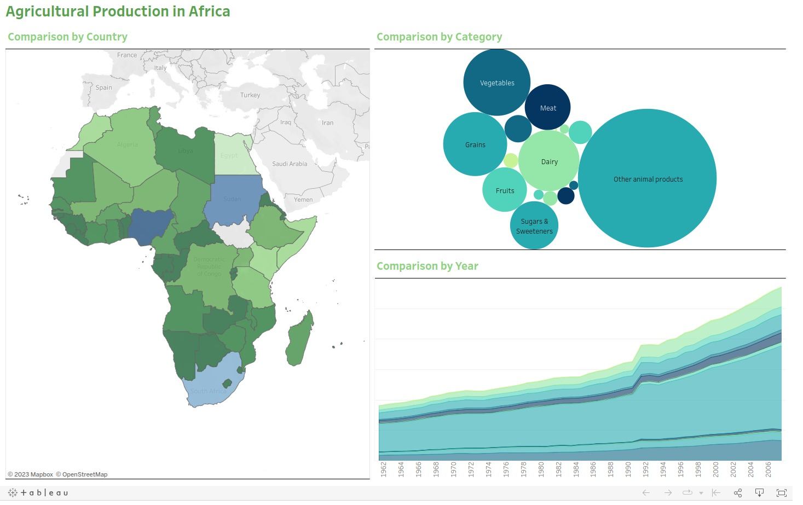

# Food Production
Analysis of agricultural production in Africa.

## Dataset
Food and Agricultural Organization collects and provides access to global data about food production. The dataset for this project was downloaded from [FAO](https://www.fao.org/faostat/en/#data/QCL).

## Data cleaning and processing
Processing the dataset was done using spark. Transformations carried out on the data included cleaning, wrangling, feature enrichment as well as validations. Pandas API on pyspark ws also used.

## Vizualizations
Further analysis and vizualizations was done using tableau. Check the complete viz [here](https://public.tableau.com/app/profile/kiplimo.cornelius/viz/AgriculturalProduction_16869066982260/AgriculturalProduction)

